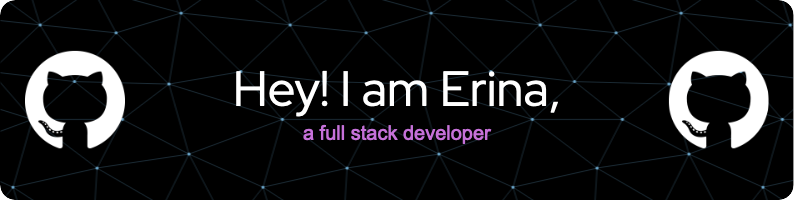

  

<h3 align="left">Connect with me:</h3>

- 🔭 I’m currently working on: Launch Academy with [makeitMVP](https://www.makeitmvp.com/) and another project with [Cherry on Tech](https://cherryon.tech/page/cohort/)
- 🌱 I’m currently learning: React and Firebase
- 👯 I’m looking to collaborate on: open source and community projects
- 📫 How to reach me: [LinkedIn](https://www.linkedin.com/in/erinaperez/) | [my Calendly](https://calendly.com/erinaperez/30min)
- ⚡ Fun fact: I used to do archaeology and forensic anthropology
- 😄 Pronouns: she/they

<h3 align="left">Languages and Tools:</h3>

                    

<!--
**erinaperez/erinaperez** is a ✨ _special_ ✨ repository because its `README.md` (this file) appears on your GitHub profile.

Here are some ideas to get you started:

- 🔭 I’m currently working on ...
- 🌱 I’m currently learning ...
- 👯 I’m looking to collaborate on ...
- 🤔 I’m looking for help with ...
- 💬 Ask me about ...
- 📫 How to reach me: ...
- 😄 Pronouns: ...
- ⚡ Fun fact: ...
-->
